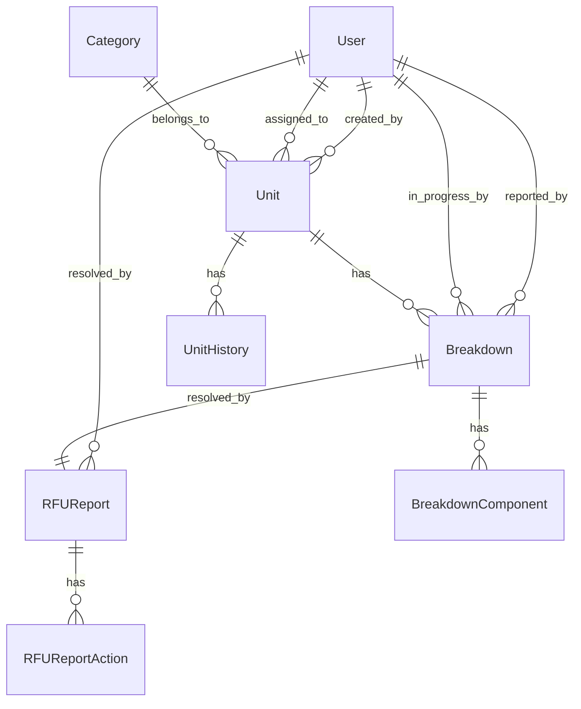

### Dokumentasi AZRA - Asset Management System v0.2.0 (29/06/2025)

## 🏢 Tentang Project

**AZRA** adalah sistem manajemen aset yang dikembangkan untuk **PT GSI** dengan fokus pada pengelolaan unit/equipment, work order, dan maintenance tracking. Sistem ini dibangun menggunakan teknologi modern dengan arsitektur yang scalable dan user-friendly.

### �� Tujuan Utama
- Manajemen aset dan equipment secara terpusat
- Tracking work order dan breakdown
- Monitoring maintenance history
- User management dengan role-based access control
- Reporting dan analytics

## 🛠️ Tech Stack

### Frontend
- **Next.js 15.3.1** - React framework dengan App Router
- **React 18.3.1** - UI library
- **TypeScript 5.6.3** - Type safety
- **HeroUI v2.7.9** - Component library
- **Tailwind CSS 3.4.16** - Styling
- **Framer Motion 11.13.1** - Animations
- **Lucide React 0.513.0** - Icons

### Backend & Database
- **Next.js API Routes** - Backend API
- **Prisma 6.10.1** - ORM
- **PostgreSQL** - Database
- **NextAuth.js 4.24.11** - Authentication
- **bcrypt 6.0.0** - Password hashing

### Development Tools
- **ESLint** - Code linting
- **Prettier** - Code formatting
- **Turbopack** - Fast bundler
- **Auto-changelog** - Changelog generation

## ��️ Arsitektur Sistem

### Struktur Database



### Model Database

#### 1. **User**
```typescript
interface User {
  id: string;
  name: string;
  email: string;
  password: string;
  role: Role;
  department?: string;
  avatar?: string;
  status?: string;
  lastActive?: Date;
  tasksCompleted?: number;
  joinDate?: Date;
}
```

**Role Types:**
- `super_admin` - Akses penuh sistem
- `admin_heavy` - Admin heavy equipment
- `admin_elec` - Admin electrical
- `pengawas` - Supervisor
- `mekanik` - Technician

#### 2. **Unit (Asset)**
```typescript
interface Unit {
  id: string;
  assetTag: string; // Unique identifier
  name: string;
  description?: string;
  categoryId: number;
  status: string; // operational, maintenance, etc.
  condition?: string;
  serialNumber?: string;
  location: string;
  department?: string;
  manufacturer?: string;
  installDate?: Date;
  warrantyExpiry?: Date;
  lastMaintenance?: Date;
  nextMaintenance?: Date;
  assetValue?: number;
  utilizationRate?: number;
}
```

#### 3. **Breakdown (Work Order)**
```typescript
interface Breakdown {
  id: string;
  breakdownNumber: string; // WO-001, WOIT-001
  description: string;
  breakdownTime: Date;
  workingHours: number;
  status: BreakdownStatus;
  priority?: string;
  shift?: string;
  unitId: string;
  reportedById: string;
  inProgressById?: string;
  inProgressAt?: Date;
}
```

**Breakdown Status:**
- `pending` - Menunggu penanganan
- `in_progress` - Sedang dikerjakan
- `rfu` - Ready for Use (selesai)
- `overdue` - Terlambat

#### 4. **RFU Report**
```typescript
interface RFUReport {
  id: string;
  solution: string;
  resolvedAt: Date;
  breakdownId: string;
  resolvedById: string;
  workDetails?: string;
}
```

## �� Fitur Utama

### 1. **Authentication & Authorization**
- Login dengan email/password
- Role-based access control
- Session management dengan NextAuth
- Password encryption dengan bcrypt

### 2. **Dashboard**
- Overview sistem dengan metrics
- Recent activities tracking
- Quick access ke fitur utama
- User profile management

### 3. **Asset Management**
- **CRUD Operations** untuk unit/equipment
- **Asset Tracking** dengan unique asset tag
- **Category Management** untuk klasifikasi
- **Location Management** untuk tracking lokasi
- **Maintenance Scheduling** dengan reminder
- **Asset History** untuk audit trail

### 4. **Work Order Management**
- **Breakdown Reporting** dengan form yang lengkap
- **Component Tracking** untuk detail kerusakan
- **Priority Management** untuk urutan prioritas
- **Shift Assignment** untuk penjadwalan
- **Status Tracking** real-time
- **In-Progress Management** untuk assign technician

### 5. **Maintenance History**
- **RFU Reports** untuk dokumentasi penyelesaian
- **Action Tracking** untuk detail pekerjaan
- **Timeline View** untuk tracking progress
- **Solution Documentation** untuk knowledge base

### 6. **User Management**
- **User CRUD** dengan role assignment
- **Department Management**
- **Activity Tracking**
- **Profile Management**

### 7. **Reporting & Analytics**
- **Asset Utilization** reports
- **Maintenance Statistics**
- **Work Order Analytics**
- **Performance Metrics**

## �� Struktur Project

```
azra/
├── app/                          # Next.js App Router
│   ├── api/                      # API Routes
│   │   ├── auth/                 # Authentication endpoints
│   │   ├── data/                 # Data endpoints
│   │   └── maintenance-history/  # Maintenance API
│   ├── dashboard/                # Dashboard pages
│   │   ├── assets/               # Asset management
│   │   ├── workorders/           # Work order management
│   │   ├── users/                # User management
│   │   └── reports/              # Reporting
│   ├── login/                    # Authentication pages
│   └── layout.tsx                # Root layout
├── components/                   # Reusable components
│   ├── ui/                       # UI components
│   │   ├── dashboard/            # Dashboard components
│   │   └── admin/                # Admin components
│   ├── home/                     # Landing page components
│   └── forms/                    # Form components
├── lib/                          # Utility libraries
│   ├── auth.ts                   # Authentication config
│   ├── prisma.ts                 # Database client
│   └── supabase.ts               # Supabase client
├── prisma/                       # Database schema & migrations
│   ├── schema.prisma             # Database schema
│   ├── migrations/               # Database migrations
│   └── seed.ts                   # Seed data
├── config/                       # Configuration files
├── types/                        # TypeScript types
└── styles/                       # Global styles
```

## 🔧 Setup & Installation

### Prerequisites
- Node.js 18+ 
- PostgreSQL database
- npm/yarn/pnpm

### Environment Variables
```env
# Database
DATABASE_URL="postgresql://..."
POSTGRES_URL_NON_POOLING="postgresql://..."

# Authentication
NEXTAUTH_SECRET="your-secret-key"
NEXTAUTH_URL="http://localhost:3000"

# Supabase (optional)
NEXT_PUBLIC_SUPABASE_URL="your-supabase-url"
NEXT_PUBLIC_SUPABASE_ANON_KEY="your-supabase-key"
```

### Installation Steps
```bash
# 1. Clone repository
git clone <repository-url>
cd azra

# 2. Install dependencies
npm install

# 3. Setup database
npx prisma generate
npx prisma db push

# 4. Seed database (optional)
npm run seed

# 5. Run development server
npm run dev
```

### Build & Deploy
```bash
# Build for production
npm run build

# Start production server
npm start
```

## 🔐 Security Features

### Authentication
- **JWT-based** session management
- **Password hashing** dengan bcrypt
- **Session timeout** (3 hari)
- **Secure cookies** dengan httpOnly

### Authorization
- **Role-based access control** (RBAC)
- **Route protection** dengan middleware
- **API endpoint protection**
- **Component-level permissions**

### Data Protection
- **Input validation** dengan Prisma
- **SQL injection prevention**
- **XSS protection**
- **CSRF protection**

## �� API Endpoints

### Authentication
- `POST /api/auth/signin` - User login
- `POST /api/auth/signout` - User logout
- `GET /api/auth/session` - Get session

### Assets
- `GET /api/assets` - Get all assets
- `POST /api/assets` - Create asset
- `PUT /api/assets/:id` - Update asset
- `DELETE /api/assets/:id` - Delete asset

### Work Orders
- `GET /api/workorders` - Get all work orders
- `POST /api/workorders` - Create work order
- `PUT /api/workorders/:id` - Update work order
- `DELETE /api/workorders/:id` - Delete work order

### Maintenance History
- `GET /api/maintenance-history` - Get maintenance logs
- `POST /api/maintenance-history` - Create maintenance log

## 🎨 UI/UX Features

### Design System
- **HeroUI v2** component library
- **Tailwind CSS** untuk styling
- **Dark/Light mode** support
- **Responsive design** untuk mobile/desktop
- **Accessibility** compliant

### User Experience
- **Tabbed interface** untuk multi-tasking
- **Real-time updates** dengan optimistic UI
- **Loading states** dan error handling
- **Form validation** dengan user feedback
- **Search dan filtering** capabilities

## 📈 Performance Optimization

### Frontend
- **Code splitting** dengan Next.js
- **Image optimization** dengan Next.js Image
- **Lazy loading** untuk components
- **Memoization** untuk expensive operations

### Backend
- **Database indexing** untuk queries
- **Connection pooling** dengan Prisma
- **Caching** untuk static data
- **API response optimization**

## �� Testing Strategy

### Unit Testing
- Component testing dengan Jest
- API endpoint testing
- Utility function testing

### Integration Testing
- Database integration tests
- Authentication flow testing
- API integration testing

### E2E Testing
- User workflow testing
- Cross-browser testing
- Mobile responsiveness testing

## 📝 Development Guidelines

### Code Standards
- **TypeScript** untuk type safety
- **ESLint** untuk code quality
- **Prettier** untuk formatting
- **Conventional commits** untuk git

### Git Workflow
- **Feature branches** untuk development
- **Pull request** reviews
- **Automated testing** pada CI/CD
- **Version tagging** untuk releases

### Documentation
- **Inline comments** untuk complex logic
- **API documentation** dengan examples
- **Component documentation** dengan props
- **Database schema** documentation

## 🚀 Deployment

### Production Environment
- **Vercel** untuk hosting
- **PostgreSQL** untuk database
- **Environment variables** management
- **SSL certificates** untuk security

### Monitoring
- **Error tracking** dengan Sentry
- **Performance monitoring**
- **Database monitoring**
- **User analytics**

## 🔄 Maintenance & Updates

### Regular Tasks
- **Database backups** harian
- **Security updates** bulanan
- **Performance monitoring** berkelanjutan
- **User feedback** collection

### Version Management
- **Semantic versioning** (SemVer)
- **Changelog** maintenance
- **Migration scripts** untuk database
- **Rollback procedures**

## 📞 Support & Contact

### Technical Support
- **Documentation** lengkap
- **Troubleshooting guides**
- **FAQ section**
- **Contact form** untuk issues

### Training & Onboarding
- **User training** materials
- **Admin training** sessions
- **Best practices** guides

---

**AZRA Asset Management System** - Made with ❤️ Azvan IT

*Dokumentasi ini akan diperbarui secara berkala sesuai dengan perkembangan sistem.*
